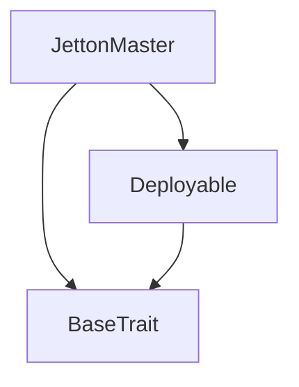
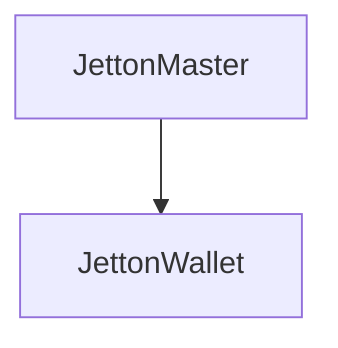

# TACT Compilation Report
Contract: JettonMaster
BOC Size: 1658 bytes

# Types
Total Types: 25

## StateInit
TLB: `_ code:^cell data:^cell = StateInit`
Signature: `StateInit{code:^cell,data:^cell}`

## StdAddress
TLB: `_ workchain:int8 address:uint256 = StdAddress`
Signature: `StdAddress{workchain:int8,address:uint256}`

## VarAddress
TLB: `_ workchain:int32 address:^slice = VarAddress`
Signature: `VarAddress{workchain:int32,address:^slice}`

## Context
TLB: `_ bounced:bool sender:address value:int257 raw:^slice = Context`
Signature: `Context{bounced:bool,sender:address,value:int257,raw:^slice}`

## SendParameters
TLB: `_ bounce:bool to:address value:int257 mode:int257 body:Maybe ^cell code:Maybe ^cell data:Maybe ^cell = SendParameters`
Signature: `SendParameters{bounce:bool,to:address,value:int257,mode:int257,body:Maybe ^cell,code:Maybe ^cell,data:Maybe ^cell}`

## ChangeOwner
TLB: `change_owner#819dbe99 queryId:uint64 newOwner:address = ChangeOwner`
Signature: `ChangeOwner{queryId:uint64,newOwner:address}`

## ChangeOwnerOk
TLB: `change_owner_ok#327b2b4a queryId:uint64 newOwner:address = ChangeOwnerOk`
Signature: `ChangeOwnerOk{queryId:uint64,newOwner:address}`

## Deploy
TLB: `deploy#946a98b6 queryId:uint64 = Deploy`
Signature: `Deploy{queryId:uint64}`

## DeployOk
TLB: `deploy_ok#aff90f57 queryId:uint64 = DeployOk`
Signature: `DeployOk{queryId:uint64}`

## FactoryDeploy
TLB: `factory_deploy#6d0ff13b queryId:uint64 cashback:address = FactoryDeploy`
Signature: `FactoryDeploy{queryId:uint64,cashback:address}`

## RecieveJettons
TLB: `recieve_jettons#4e86a070 sender:address amount:int257 = RecieveJettons`
Signature: `RecieveJettons{sender:address,amount:int257}`

## Transfer
TLB: `transfer#0f8a7ea5 query_id:uint64 amount:coins reciever:address response_destination:address custom_payload:Maybe ^cell forward_ton_amount:coins forward_payload:Maybe ^cell = Transfer`
Signature: `Transfer{query_id:uint64,amount:coins,reciever:address,response_destination:address,custom_payload:Maybe ^cell,forward_ton_amount:coins,forward_payload:Maybe ^cell}`

## TransferNotification
TLB: `transfer_notification#7362d09c query_id:uint64 amount:coins sender:address forward_payload:Maybe ^cell = TransferNotification`
Signature: `TransferNotification{query_id:uint64,amount:coins,sender:address,forward_payload:Maybe ^cell}`

## InternalTransfer
TLB: `internal_transfer#178d4519 query_id:uint64 amount:coins from:address response_address:address forward_ton_amount:coins forward_payload:Maybe ^cell = InternalTransfer`
Signature: `InternalTransfer{query_id:uint64,amount:coins,from:address,response_address:address,forward_ton_amount:coins,forward_payload:Maybe ^cell}`

## Excesses
TLB: `excesses#d53276db query_id:uint64 = Excesses`
Signature: `Excesses{query_id:uint64}`

## Burn
TLB: `burn#595f07bc query_id:uint64 amount:coins response_destination:address custom_payload:Maybe ^cell = Burn`
Signature: `Burn{query_id:uint64,amount:coins,response_destination:address,custom_payload:Maybe ^cell}`

## BurnNotification
TLB: `burn_notification#7bdd97de query_id:uint64 amount:coins sender:address response_destination:address = BurnNotification`
Signature: `BurnNotification{query_id:uint64,amount:coins,sender:address,response_destination:address}`

## ChangeContent
TLB: `change_content#10590ef2 jetton_content:^cell = ChangeContent`
Signature: `ChangeContent{jetton_content:^cell}`

## Buy
TLB: `buy#6f166828 query_id:uint64 amount:int257 = Buy`
Signature: `Buy{query_id:uint64,amount:int257}`

## JettonData
TLB: `_ total_supply:int257 mintable:bool admin_address:address jetton_content:^cell jetton_wallet_code:^cell = JettonData`
Signature: `JettonData{total_supply:int257,mintable:bool,admin_address:address,jetton_content:^cell,jetton_wallet_code:^cell}`

## JettonMaster$Data
TLB: `null`
Signature: `null`

## WalletData
TLB: `_ balance:coins owner:address jetton:address jetton_wallet_code:^cell = WalletData`
Signature: `WalletData{balance:coins,owner:address,jetton:address,jetton_wallet_code:^cell}`

## JettonWallet$Data
TLB: `null`
Signature: `null`

## MarketData
TLB: `_ jetton_price:coins jetton_master_address:address owner:address = MarketData`
Signature: `MarketData{jetton_price:coins,jetton_master_address:address,owner:address}`

## JettonMarket$Data
TLB: `null`
Signature: `null`

# Get Methods
Total Get Methods: 2

## get_jetton_data

## get_wallet_address
Argument: owner_address

# Error Codes
2: Stack underflow
3: Stack overflow
4: Integer overflow
5: Integer out of expected range
6: Invalid opcode
7: Type check error
8: Cell overflow
9: Cell underflow
10: Dictionary error
11: 'Unknown' error
12: Fatal error
13: Out of gas error
14: Virtualization error
32: Action list is invalid
33: Action list is too long
34: Action is invalid or not supported
35: Invalid source address in outbound message
36: Invalid destination address in outbound message
37: Not enough TON
38: Not enough extra-currencies
39: Outbound message does not fit into a cell after rewriting
40: Cannot process a message
41: Library reference is null
42: Library change action error
43: Exceeded maximum number of cells in the library or the maximum depth of the Merkle tree
50: Account state size exceeded limits
128: Null reference exception
129: Invalid serialization prefix
130: Invalid incoming message
131: Constraints error
132: Access denied
133: Contract stopped
134: Invalid argument
135: Code of a contract was not found
136: Invalid address
137: Masterchain support is not enabled for this contract
3688: Not mintable
19756: No permissions
29170: No permission
36073: Not enought jettons
47147: Not enough jettons
48540: Not enough tons
51724: Invalid ton amount

# Trait Inheritance Diagram

# Contract Dependency Diagram

